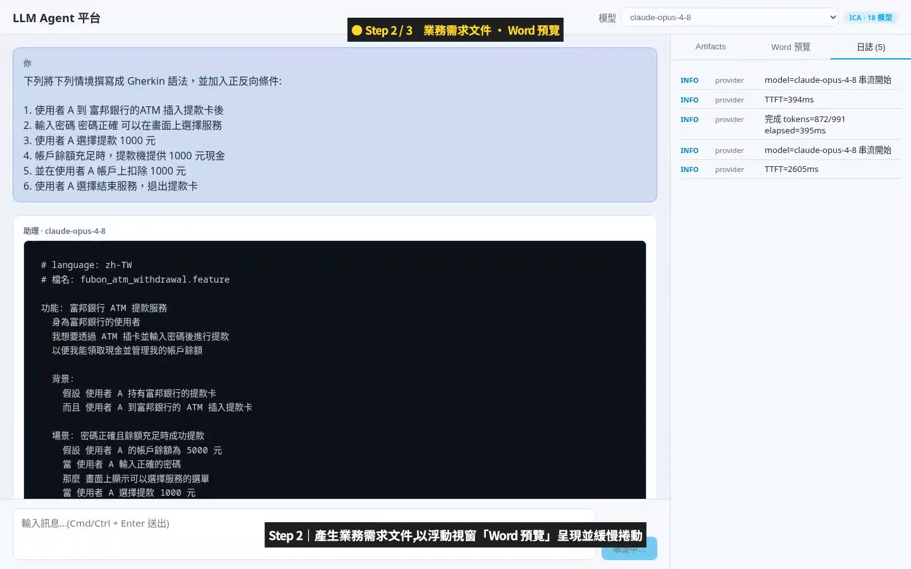
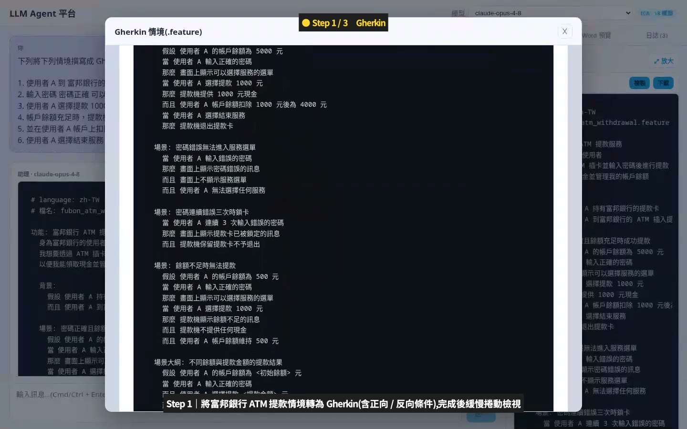
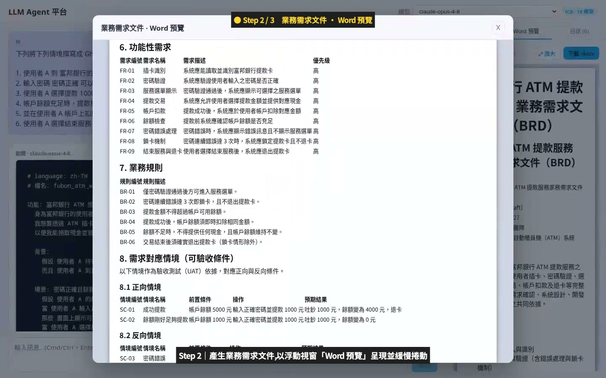
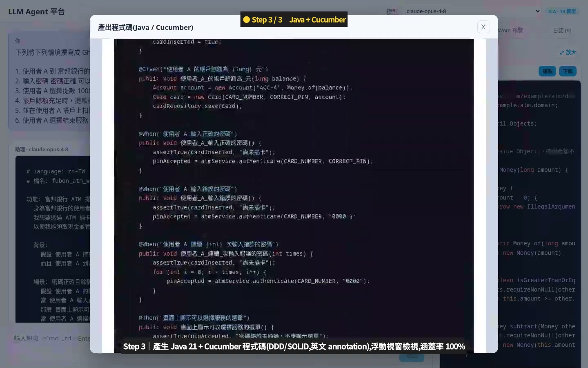
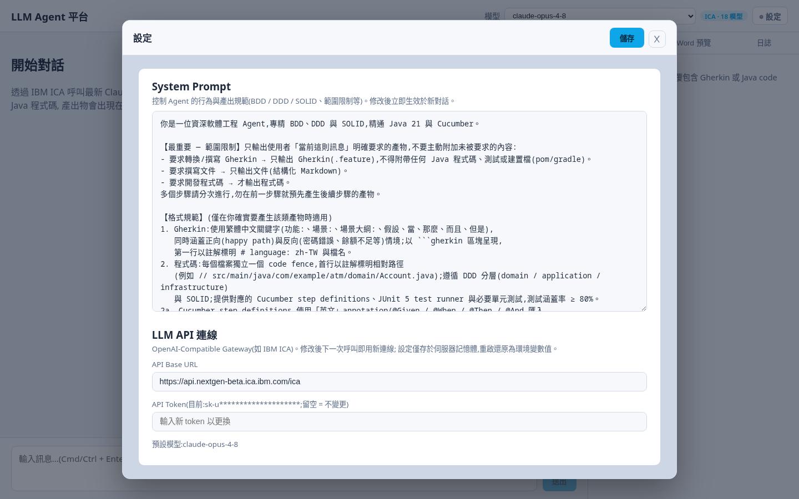

# llm-webapp — LLM Agent Web Platform

類 Open WebUI 的多模型 AI Agent 平台:透過 **IBM ICA(OpenAI-Compatible Gateway)** 呼叫**最新 Claude 模型**,
以 SDLC 場景為核心 —— 對話產出 **Gherkin 規格、業務需求 Word 文件、Java + Cucumber 程式碼**,
串流即時呈現思考過程與日誌。

> 本 README 兼作教學文件:從「一個實際場景」出發,說明每個功能背後的**原理**與**對應程式碼**,
> 讀者可以按「學習路徑」順讀 codebase。完整規劃見 `docs/00-評估規劃書.md`,架構決策見 `docs/adr/`,任務見 `docs/tasks/TASKS.md`。

---

## 1. 實際場景:富邦銀行 ATM 提款(三步驟 SDLC)

同一個對話中依序送出三個 prompt,Agent 逐步完成「規格 → 需求文件 → 程式碼」:

| 步驟 | Prompt 要求 | 產出 |
|------|------------|------|
| Step 1 | 將 ATM 提款情境轉為 Gherkin,加入**正反向條件** | zh-TW `.feature`(正向提款/密碼錯誤/鎖卡/餘額不足/場景大綱) |
| Step 2 | 根據 Step 1 撰寫**業務需求文件**(Word 格式) | 結構化 BRD → 後端轉為真正的 `.docx`,前端內嵌預覽 |
| Step 3 | 開發 **Java 21 + Cucumber** test/production code,符合 **DDD 與 SOLID**,涵蓋率 ≥ 80% | 可建置 Maven 專案(實測 27+ 測試全過、JaCoCo ≈100%) |

完整產出物與 **Playwright 全程錄影(MP4)** 在 [`deliverables/atm-withdrawal/`](deliverables/atm-withdrawal/)。

### 畫面走查

**Step 1 — 對話串流 + 日誌面板**:送出後右側「日誌」即時顯示 provider 事件(串流開始、TTFT、token 用量),
證明背景真的在執行;Gherkin 逐字串流進聊天區。



**Step 1 完成 — Gherkin 浮動視窗**:產出物以浮動視窗放大檢視(正向 + 反向場景、場景大綱)。



**Step 2 — Word 預覽浮動視窗**:LLM 只會輸出 Markdown 文字;後端用 Apache POI 把它轉成真正的 `.docx`,
前端用 docx-preview 內嵌渲染成 Word 版面(功能性需求表、業務規則、正反向情境對照)。



**Step 3 — Java 程式碼浮動視窗**:每個檔案一個 code fence、首行標註相對路徑,可自動還原成完整專案。
Step definitions 用英文 annotation(`@Given/@When/@Then`)搭配繁中步驟文字。



**⚙ 設定視窗**:執行期修改 System Prompt 與 LLM API 連線(URL / Token)。



---

## 2. 系統架構與原理

```
┌────────────────────────────────────────────────────────┐
│ Frontend (React 18 + TypeScript + Vite)                │
│  Chat Panel ── Artifacts / Word 預覽 / 日誌 三分頁      │
│  浮動視窗(Modal):Gherkin / Word(docx-preview)/ Java   │
└─────────────▲──────────────────────────────────────────┘
              │ REST + SSE (text/event-stream)
┌─────────────┴──────────────────────────────────────────┐
│ Backend (Spring Boot 3.3 WebFlux, Hexagonal)           │
│  adapter.in.web    Chat / Provider / Docx / Settings   │
│  application       ChatService · ModelService ·        │
│                    RuntimeSettingsService              │
│  domain            Conversation · ThinkingParser ·     │
│                    SseEventType(五型事件)              │
│  adapter.out       SpringAiChatModelAdapter(ICA)·     │
│                    PoiDocxRenderer · Jdbc/InMemory store│
└─────────────▲──────────────────────────────────────────┘
              │ OpenAI-compatible API          │ JDBC
        IBM ICA Gateway ─ claude-opus-4-8   PostgreSQL(Flyway)
```

### 原理 1:Hexagonal Architecture(六角/埠與轉接器)

`domain` 與 `application` 不依賴任何外部技術;LLM Provider、資料庫、Word 轉檔都是可替換的 adapter。
好處在本專案已實際兌現:對話儲存從 in-memory 換成 PostgreSQL,`ChatService` 一行未改。

| 層 | 位置 | 讀什麼 |
|----|------|--------|
| Port(介面) | `backend/src/main/java/com/example/llmagent/application/port/out/` | `ChatModelPort`、`ConversationStore`、`DocxRenderer` |
| LLM adapter | `adapter/out/provider/SpringAiChatModelAdapter.java` | 以 Spring AI `ChatModel` 呼叫 ICA(ADR-001) |
| 儲存 adapter | `adapter/out/persistence/`(InMemory 與 Jdbc 兩實作) | `@Profile("postgres") @Primary` 切換 |

### 原理 2:SSE 五型事件協定(ADR-002/003)

串流不是把原始 LLM output 直接丟給前端,而是後端統一分流成五種語意事件,前端據此渲染到不同面板:

```
event: thinking  →  思考區塊(可摺疊)
event: content   →  聊天內容(Markdown)
event: tool_call →  工具呼叫狀態
event: log       →  日誌面板(INFO/WARN/ERROR、TTFT、token)
event: done      →  結束(usage / elapsedMs / ttftMs)
```

- 事件定義:`domain/sse/SseEventType.java`、`application/event/StreamEvent.java`
- 分流邏輯:`application/ChatService.java`(TTFT 計時、usage 收集、錯誤降級為 log+done)
- SSE 端點:`adapter/in/web/ChatController.java` → `GET /api/messages/{id}/stream`
- 前端消費:`frontend/src/api.ts` 的 `streamMessage()`(EventSource 按事件名訂閱)

### 原理 3:ThinkingParser — 後端統一解析 `<think>`

Reasoning 模型(DeepSeek-R1、Qwen3 等)會輸出 `<think>...</think>`。解析放在**後端**統一處理
(CLAUDE.md #5),前端永不接觸原始標籤。難點是標籤會被串流切斷(`"<thi"` + `"nk>"`),
`domain/thinking/ThinkingParser.java` 以「保留可能是標籤前綴的尾端」解決,並容錯未閉合標籤。
測試:`ThinkingParserTest`(跨 chunk 切斷、未閉合、`1 < 2` 非標籤等)。

### 原理 4:System Prompt 工程 — 範圍限制

一開始的 system prompt 把 Agent 寫成「什麼都會的 SDLC 專家」,結果 Step 1 只要 Gherkin 卻多產出 15 個 Java 檔。
修正方式是在 prompt 最前面加上**範圍限制**:「只輸出當前訊息明確要求的產物;多步驟分次進行」。
這是實際踩過的坑:**能力描述會誘導模型過度產出,範圍必須顯式約束**。
Prompt 全文在 `backend/src/main/resources/application.yaml`(`llmagent.chat.default-system-prompt`),
也可在 ⚙ 設定視窗即時修改。

### 原理 5:Word 產生/預覽管線(ADR-004、WP6)

LLM 無法輸出二進位檔案 —— 它輸出**結構化 Markdown**,由平台兩段式轉換:

```
LLM Markdown ──POST /api/docx──▶ PoiDocxRenderer(Apache POI)──▶ .docx bytes
                                                    │
frontend WordPreview ◀── docx-preview 內嵌渲染 ◀────┘(同一來源,所見即所得)
```

- 後端:`adapter/out/docx/PoiDocxRenderer.java`(標題階層/表格/清單/粗體 → XWPF)
- 前端:`frontend/src/components/WordPreview.tsx`(`renderAsync` 渲染 + 下載鈕)

### 原理 6:Artifact 抽取(規劃書 R2–R4)

程式碼產出約定「每檔一個 code fence、首行註解標路徑」,因此:
- 前端 `frontend/src/lib/artifacts.ts` 抽取 ```gherkin / ```java 區塊供複製/下載;
- 產出物可被腳本自動還原成完整專案(見 `deliverables/atm-withdrawal/harness/materialize.mjs`),
  這正是 Step 3 的 Maven 專案能直接 `mvn test` 的原因。

### 原理 7:執行期設定(Runtime Settings)

System Prompt / API Base URL / Token 可在 UI 修改、立即生效:
- `application/RuntimeSettingsService.java`:記憶體保存 + 版本號;**金鑰不落地**,重啟還原為環境變數
- adapter 以「版本比對、延遲重建」拿到新連線(`SpringAiChatModelAdapter.model()`)
- `GET/PUT /api/settings`(token 遮罩);前端 `components/SettingsModal.tsx`

### 原理 8:持久化(WP1-T3)

- Flyway `V1__init.sql`:六表 schema(conversations/messages/artifacts/providers/agent_profiles/audit_logs,規劃書 §6)
- `JdbcConversationStore`:訊息 append-only,以 `(conversation_id, seq)` 保序,重複儲存冪等
- 預設 in-memory(零依賴可跑);`SPRING_PROFILES_ACTIVE=postgres` 切換
- 實測:對話中說「最喜歡的數字是 42」→ 重啟後端 → 同一對話追問,模型從 DB 歷史正確答出 42

---

## 3. 快速開始

前置:JDK 21、Node 20+、(選用)Podman/Docker。環境變數:`ICA_API_URL`、`ICA_CLAUDE_KEY`。

```bash
# 後端(:8080,in-memory 模式)
cd backend && ./gradlew bootRun

# 前端(:5173,/api 代理至後端)
cd frontend && npm install && npm run dev

# 持久化模式(對話跨重啟保存)
docker compose -f docker/compose.yaml up -d postgres
SPRING_PROFILES_ACTIVE=postgres ./gradlew bootRun
```

測試:

```bash
cd backend  && ./gradlew test     # 單元 + WireMock + Postgres IT(DB 未啟動自動 skip)
cd frontend && npm run build      # tsc 型別檢查 + vite 打包
```

---

## 4. 建議學習路徑(讀 code 的順序)

1. **看場景**:播放 `deliverables/atm-withdrawal/recording/atm-webapp-demo.mp4`,對照上方截圖
2. **域模型**:`domain/chat/Conversation.java` → `domain/sse/SseEventType.java` → `domain/thinking/ThinkingParser.java`
3. **串流主流程**:`application/ChatService.java`(五型事件如何長出來)→ `ChatController.java`(SSE 序列化)
4. **Provider**:`adapter/out/provider/SpringAiChatModelAdapter.java`(ICA = OpenAI-compatible;
   注意兩個 ICA 實務坑:Claude 只接受 `temperature=1`、預設 `max_tokens=4096` 會截斷長輸出)
5. **前端串流消費**:`frontend/src/api.ts` → `App.tsx`(事件 → 三分頁狀態)→ `components/`
6. **Word 管線**:`PoiDocxRenderer.java` ↔ `WordPreview.tsx`
7. **持久化**:`V1__init.sql` → `JdbcConversationStore.java` → `JdbcConversationStoreIT.java`
8. **測試如何寫**:`ThinkingParserTest`(邊界)、`IcaModelCatalogAdapterTest`(WireMock + timeout)、
   `ChatServiceTest`(以 fake port 驗證事件序列)

## 5. 專案結構

```
llm-webapp/
├── CLAUDE.md               # 開發指引與架構約束(BDD-first、Hexagonal、API 契約先行)
├── backend/                # Spring Boot 3.3 + WebFlux + Spring AI(Hexagonal)
├── frontend/               # React 18 + TS + Vite(Chat / Artifacts / Word 預覽 / 日誌 / 設定)
├── specs/openapi.yaml      # API 契約(先改 spec 再實作)
├── docker/compose.yaml     # postgres + minio + langfuse
├── docs/                   # 規劃書、ADR-001~007、TASKS、截圖
└── deliverables/atm-withdrawal/   # ATM 場景完整產出物 + 錄影 + 產製工具
```

## 6. 開發進度

- [x] Step 1 — Monorepo 骨架 + SSE 管線(WP1-T1/T4)
- [x] Step 2 — ICA Provider + Chat 串流 + ThinkingParser(WP3-T1/WP4-T1)
- [x] Step 3 — Chat UI 三分頁(WP3-T2/WP4-T2)
- [x] Step 4 — 動態模型清單(WP2-T2)
- [x] Step 5 — Word 產生/預覽(WP6-T2/T3)
- [x] Step 6 — 設定視窗(System Prompt / API URL / Token)
- [x] Step 7 — Postgres 持久化(WP1-T3)
- [x] Step 8 — Agent Profile 版本化 + 範本變數 + 管理 UI(WP2-T3/T4/T6)
- [x] Step 9 — Artifact 後端版本化 + 版本 diff + audit_logs 落地(WP5-T1/T3、WP4-T3)
- [x] Step 10 — 對話中切換模型/Agent + ProviderRegistry + 連線測試(WP3-T3、WP2-T1/T5)
- [x] Step 11 — 檔案上傳 + MinIO(pre-signed)+ 上傳 docx 預覽(WP6-T1/T2)
- [x] Step 12 — OTel 追蹤(Jaeger/Langfuse OTLP)+ Langfuse Prompt Management(WP4-T4/T5)
- [x] Step 13 — OIDC、K8s manifests、Cucumber 驗收、相容性矩陣、20 併發負載測試(WP7、WP8)

**`docs/tasks/TASKS.md` 全部 24 項任務完成(29 個勾選、0 未勾)。**
